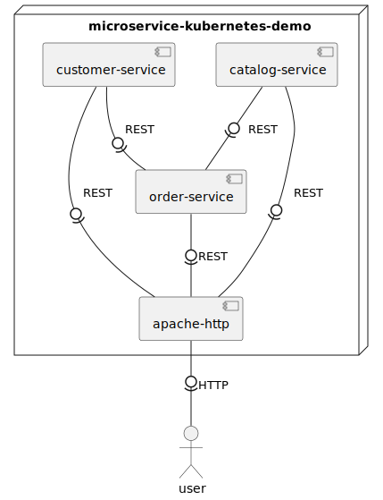

# Microservice Kubernetes Demo
This Microservice Kubernetes Demo application is used for the Chaos Engineering experiments.
The application is written by ewolff (repo is linked as submodule).

The [microservice deployment files](microservices.yaml) are using the following docker hub images:
* [apache](https://hub.docker.com/repository/docker/tuncercatalkaya/microservice-kubernetes-demo-apache)
* [catalog](https://hub.docker.com/repository/docker/tuncercatalkaya/microservice-kubernetes-demo-catalog)
* [customer](https://hub.docker.com/repository/docker/tuncercatalkaya/microservice-kubernetes-demo-customer)
* [order](https://hub.docker.com/repository/docker/tuncercatalkaya/microservice-kubernetes-demo-order)

## Architecture
todo: description of demo application



## Edited Version
The application itself was not running out of the box. All non-POST requests returned:
```
405 Request method 'POST' not supported
```
The reason for this was that Thymeleaf form th:method="delete" and "put" is passing these as
parameters in a 'POST' request instead of doing a 'DELETE' or 'PUT' request.
In order for the 'POST' request with their parameters to work, it is required
to add a spring filter to handle these type of request.  
Sources: ([link1](https://stackoverflow.com/questions/52215877/thymeleaf-405-request-method-post-not-supported)
|
[link2](https://stackoverflow.com/questions/72744349/thymeleaf-thmethod-delete-put-leads-to-request-method-post-not-supported))

Spring boot out of the box is not delivering this filter. To include these filter,
the following properties should be added to the application.properties of the services:
```properties
spring.mvc.hiddenmethod.filter.enabled=true
spring.webflux.hiddenmethod.filter.enabled=true
```
I also replaced the @RequestMapping annotations with:
```java
@PutMapping("/requestpath")
@DeleteMapping("/requestpath")
```

I made these changes inside the [vm](../vm/) and saved it as microservice-kubernetes-edited.
The edited version is also the one that is used in the docker hub images linked at the top
of this markdown file.