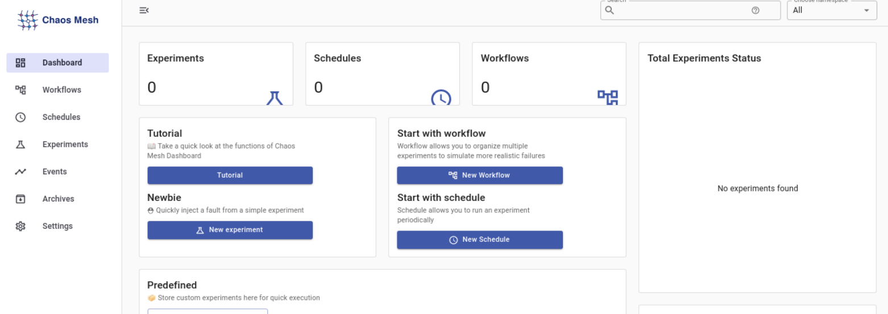

# Chaos Mesh
Chaos Mesh is a chaos engineering tool that has many features such as PodChaos
and StressChaos. For further information
check out the [chaos-mesh repository](chaos-mesh).

In the [pod-kill-experiment directory](pod-kill-experiment) is explained how to run such
an experiment for chaos-mesh.

## Description of the files in this directory
The following files, which are placed in this directory, are used for all the
chaos engineering experiments for chaos-mesh.

### microservices.yaml
This file is the same as the one from the [microservice-kubernetes-demo](../../microservice-kubernetes-demo),
but with the addition of selector labels to pair up certain services together.

### Demo chaos-mesh deploy script
Deployment script to deploy the demo application with chaos-mesh in a Kubernetes Cluster. Also
add customresourcedefinitions that are needed for chaos-mesh.
Also, the role management is disabled since it is not needed for the planned
experiments yet.

### Demo chaos-mesh delete script
Delete script to teardown the Kubernetes Cluster that was deployed from the deployment script.

## How to run the Kubernetes Cluster
Assuming you are using the [vm](../vm/) in this repository.

First start minikube.
```shell
minikube start --memory=4000  # Can also add --cpu NUMBER_OF_CPUS
                              # --driver=docker should automatically be used
```
Check if minikube launched properly.
```shell
kubectl config current-context # Should return minikube as current context
```
Run the deployment script.
```shell
~/chaos-engineering-tools-examples/tools/chaos-mesh-tool/demo-chaos-mesh-deploy.sh
```
Check the status of pods/services.
```shell
kubectl get pods                # get pods from default namespace
kubectl get svc                 # get services from default namespace
kubectl get pods -n chaos-mesh  # get pods from chaos-mesh namespace
```
Check helm deployment status.
```shell
helm ls -n chaos-mesh
```
Access Chaos Mesh Dashboard.
```shell
minikube service list -n chaos-mesh chaos-dashboard
```
Copy from the output the URL for http/2333. And paste it in a browser.
(start a separate terminal or open another tab).
```shell
chromium # Start chromium (can be any browser)
```
You should see this dashboard in the browser.


Access demo application frontend (start a separate terminal or open another tab).
```shell
kubectl port-forward deploy/apache 8081:80 # Frontend can be accessed at -> localhost:8081
```

## How to stop the Kubernetes Cluster
Assuming you are using the [vm](../vm/) in this repository.

Run the delete script.
```shell
~/chaos-engineering-tools-examples/tools/chaos-mesh-tool/demo-chaos-mesh-delete.sh
```
Check the status of pods/services.
```shell
kubectl get pods                # get pods from default namespace
kubectl get svc                 # get services from default namespace
kubectl get pods -n chaos-mesh  # get pods from chaos-mesh namespace
```
Check helm deployment status.
```shell
helm ls -n chaos-mesh
```
Stop/Delete minikube. Only required when you are done with all the Kubernetes experiments.
```shell
minikube stop
minikube delete
```