# Pod kill experiment for chaos-mesh
Every minute a random pod, from the ones that opted-in (customer-service and order-service),
is killed.

## How to run the experiment
Run the Kubernetes Cluster by following the steps from [chaos-mesh README](../README.MD).  
After these steps the Chaos Mesh Dashboard should be launched and displayed in
a browser.

In order to kill a pod every minute in chaos-mesh, it is required to add a new *schedule*.

### Go to Schedules
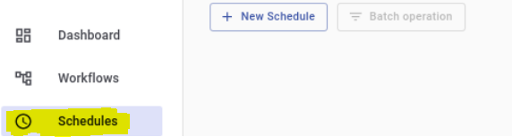

### Create new schedule
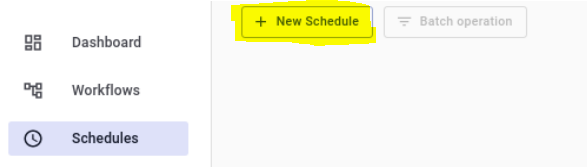

### Inject into Kubernetes, Pod Fault, Pod kill and submit
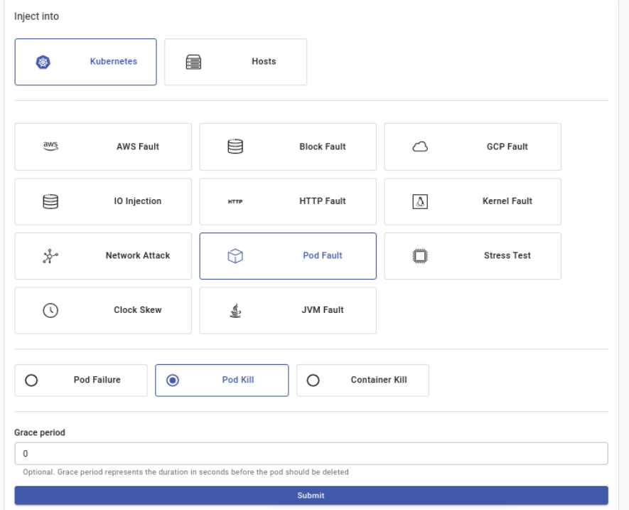

### Fill the schedule info and submit
* Name: `pod-kill-customer-order-every-minute-schedule`
* Namespace Selectors: `default`
* Label Selectors: `runCustomOrder: custom-order`  
Extra Kubernetes Selector to select customer-service and order-service
* Mode: `Fixed Number`
* Mode value: `1`
* Schedule: `@every 1m`
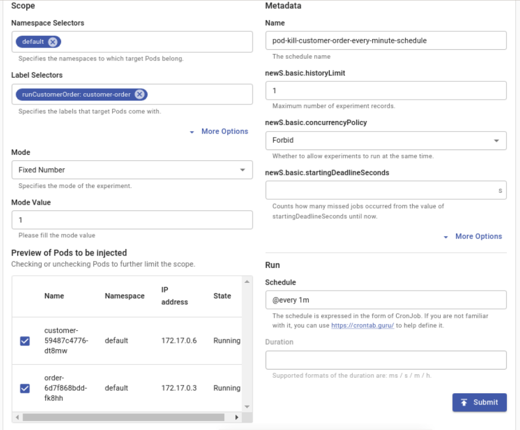

### Submit the configured schedule
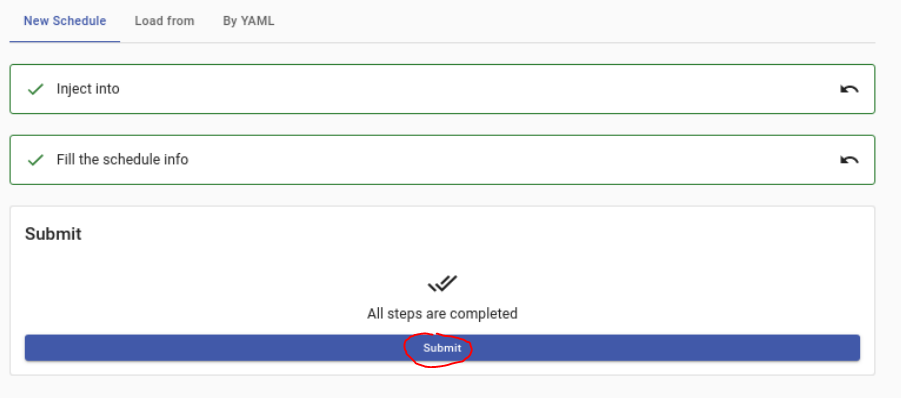

### The new schedule should be now displayed in the schedules tab
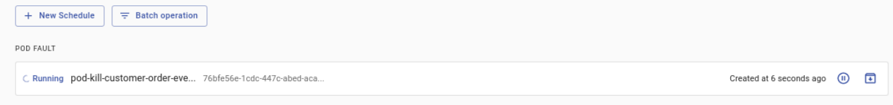
The schedule is creating every minute a new experiment in the Experiments tab
with the configured pod kill settings and the name of the created schedule
with a UUID attached to it.
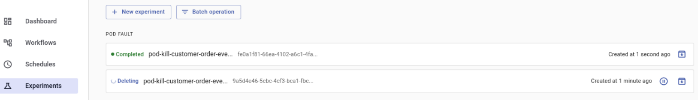

## How to check the status of the experiment
There are multiple places where it is possible to check the status of the experiment.

### Inside the created schedule
Click on the created schedule.
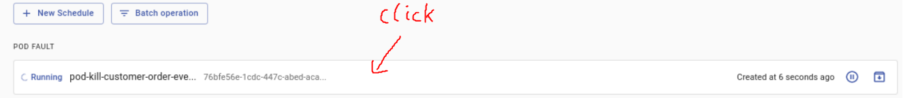

The event information are displayed in the marked area.
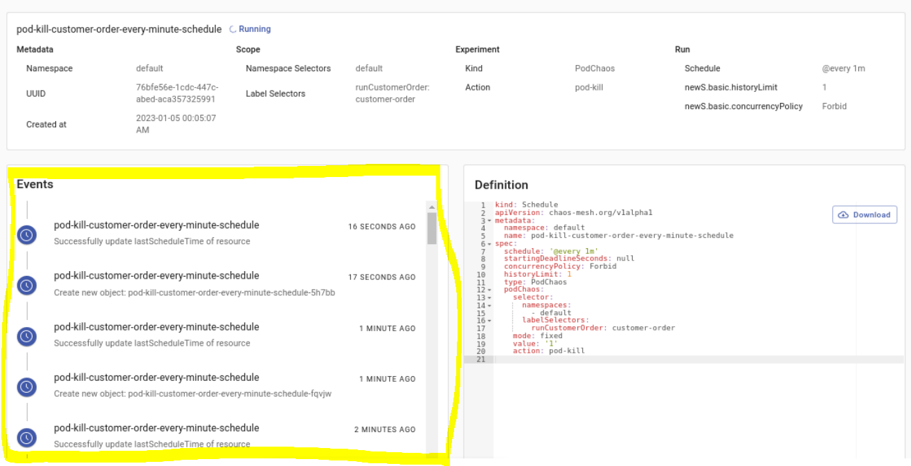

### At the dashboard
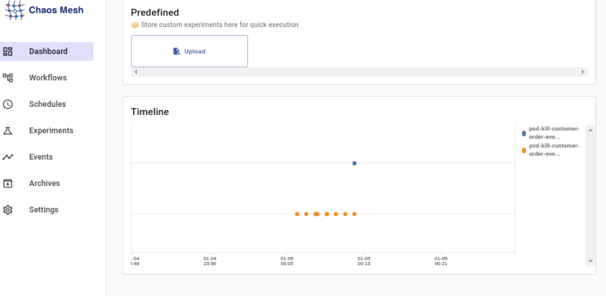

### At the events
Click on the created schedule.
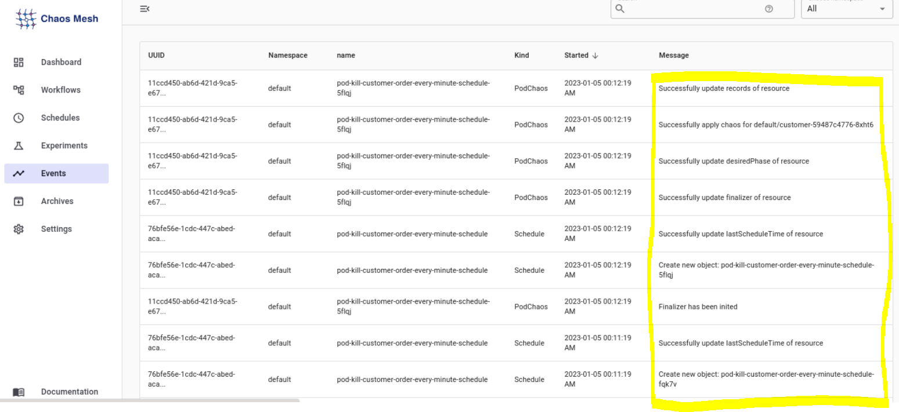

### Check pods in Kubernetes
The customer-service or order-service should be killed every minute.
```shell
kubectl get pods # get pods from default namespace
```