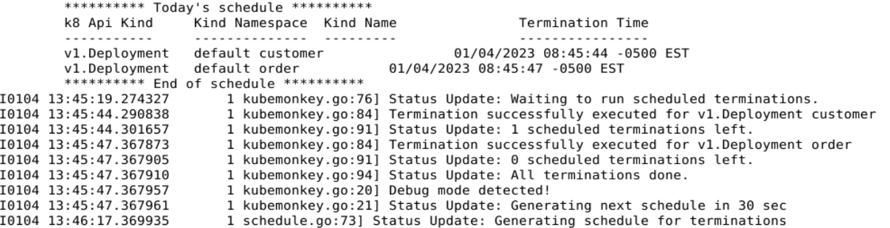

# Pod kill experiment for kube-monkey
Every 30 seconds a random pod, from the ones that opt-in (customer-service and order-service),
is killed. It still depends on a coin toss from kube-monkey if it gets actually killed.

## How to run the experiment
Run the Kubernetes Cluster by following the steps from [kube-monkey-tool README](../README.MD).

After that, the experiment itself is running already. The logs should look like

## How to check the status of the experiment
Check logs of kube-monkey (start a separate terminal or open another tab).
```shell
kubectl logs -n kube-monkey -l release=kube-monkey -f
```

The output of the logs should show the schedule for today and that the termination
was successfully executed. It should look like this:


The schedule is generated every 30 seconds since the kube-monkey helm deployment
was passed with the parameter `config.debug.schedule_immediate_kill=true`.

Check pods. The customer-service and order-service should be killed every 30 seconds.
It still depends on a coin toss from kube-monkey if it gets actually killed.
```shell
kubectl get pods                # get pods from default namespace
```