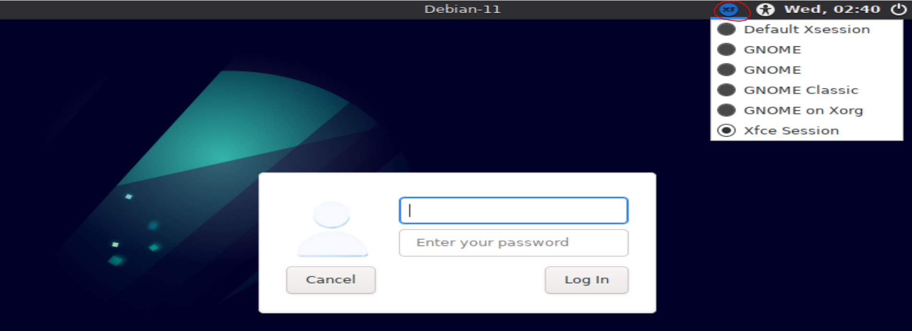

# Virtual Machine (Debian-11.6)
This Virtual Machine is used to run all the experiments in the repository. All the required software
to run the experiments are pre-installed. It is also assumed that you are using this vm when trying
to run the experiments.

## Configured Users
| Name       | Password |
|------------|----------|
| vboxuser   | vboxuser |

## Installed tools
These tools are at least needed to run the experiments. The versions that are
currently on the vm are provided in the comments of each version check command.

### Java
```shell
java --version # openjdk 11.0.16 2022-07-19
```

### Docker
```shell
docker --version # Docker version 20.10.22, build 3a2c30b
```

### Kubernetes
```shell
kubectl version # Client version v1.26.0, Kustomize version v4.5.7
```

### Minikube
```shell
minikube version # minikube version: v1.28.0
```

### Helm
```shell
helm version # v3.10.3
```

## Configured environment variables
~/.bashrc
```bash
export JAVA_HOME=/usr/lib/jvm/java-11-openjdk-amd64
export DOCKER_ACCOUNT=tuncercatalkaya
```

## How to install / run the VM
It is required to have [Virtualbox](https://www.virtualbox.org/) installed.

The appliance is provided on [Google Drive](https://drive.google.com/file/d/1aYfhoHfwrubORSjdMd2-dwf1hInTLDWw/view?usp=share_link).
Download it and import the appliance in virtualbox. It is recommended to use 6GB RAM, 2 CPUs and 32GB for disk usage.

By default, the german keyboard layout is used. Also by default, the XFCE desktop environment should be selected.
This can be changed on the top of the login screen.


